# 网络协议分析


## 第一章


### Wireshark的优势

1. 安装方便
2. 简单易用的界面
3. 提供丰富的功能


### Wireshark的作用

1. 检测网络问题
2. 为新的通讯协定除错
3. 学习网络协议相关知识

**wireshark不会修改封装包的内容，不会发送封包至网络上。**


### Wireshark的过滤规则

#### 捕捉过滤器

过滤规则共有两种形式：

1. 一个原语（Primitive）

2. 用 ”and”, “or”, “not” 关系运算符，以及括号”()”将原语组合起来而构成的表达式； 

[not] **primitive** [and|or [not] **primitive** ...

eg：

```
ether [src|dst] host <mac_addr>

[src|dst]  host  <ip_addr>

[tcp|udp]  [src|dst]  port  <number>
```


#### 显示过滤器

类似C语言的表达式

关系运算符：==, >, <=, != 等

逻辑连接符：&&, ||, ! 等 

还可以用 ( ) 来指定运算顺序

例：显示192.168.10.1除了http外的所有报文
 ip.addr==192.168.10.1 && tcp.port!=80


### WinPcap 

WinPcap是一个**基于Win32平台的，用于捕获网络数据包并进行分析的开源库**。 利用网络数据包捕获库函数可直接访问网络，免费、公用。为应用程序提供了一组API接口，编程容易，源码级移植方便。


### WinPcap 主要结构

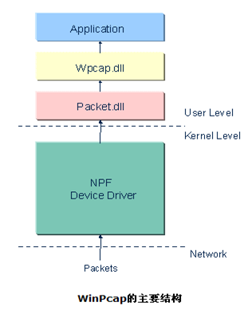


### WinPcap 主要功能

1. 捕获原始数据包，无论它是发往某台机器的，还是在其他设备（共享媒介）上进行交换的
2. 在数据包发送给某应用程序前，根据用户指定的规则过滤数据包
3. 将原始数据包通过网络发送出去
4. 收集并统计网络流量信息


### 使用 WinPcap 的程序

* 网络与协议分析器 (network and protocol analyzers) 

* 网络监视器 (network monitors) 

* 网络流量记录器 (traffic loggers) 

* 网络流量发生器 (traffic generators) 

* 用户级网桥及路由 (user-level bridges and routers) 

* 网络入侵检测系统 (network intrusion detection systems) 

* 网络扫描器 (network scanners) 

* 安全工具 (security tools) 


### WinPcap 不能胜任的事情

 WinPcap 能独立地通过主机协议发送和接受数据，如同TCP/IP。

但 WinPcap 不能阻止、过滤或操纵同一机器上的其他应用程序的通讯：它仅仅能简单地"监视"在网络上传输的数据包。

所以，它不能提供类似网络流量控制、服务质量调度和个人防火墙之类的支持。


### 使用WinPcap进行抓包的一般函数调用流程

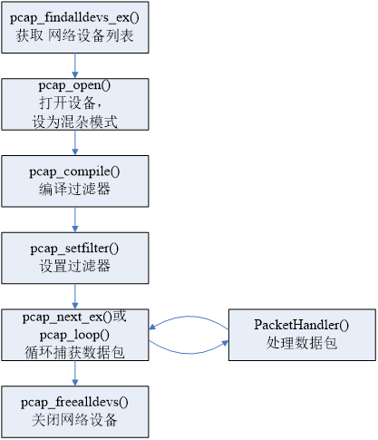


### 获得设备列表

通常，编写基于WinPcap应用程序的第一件事情，就是获得已连接的网络适配器列表。WinPcap提供了 pcap_findalldevs_ex( )函数来实现这个功能:

```c
int pcap_findalldevs_ex  ( 
            char                                 *  source,  
            struct pcap_rmtauth     *  auth,  
            pcap_if_t                        **  alldevs,  
            char                                 *  errbuf   
 ) 
```

它除了可以列出本地机器的网络设备，还可以列出远程机器上的设备。

返回：

```c
struct pcap_if
{
pcap_if * next
     //if not NULL, a pointer to the next element in the list; NULL for the last element of the list
char * name
     //a pointer to a string giving a name for the device to pass to pcap_open_live()
char * description
     //if not NULL, a pointer to a string giving a human-readable description of the device
pcap_addr * addresses
    //a pointer to the first element of a list of addresses for the interface
u_int flags
    //PCAP_IF_ interface flags. Currently the only possible flag is PCAP_IF_LOOPBACK,
    //that is set if the interface is a loopback interface.
}

```

由 pcap_findalldevs_ex()返回的每一个 pcap_if 结构体，都包含一个 pcap_addr 结构体，这个结构体由如下元素组成：

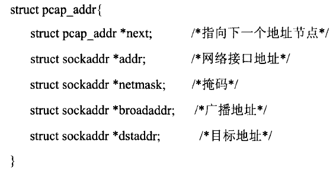


### 打开适配器开始捕获数据包

**打开适配器并捕获数据包**

打开设备的函数是pcap_open()。 

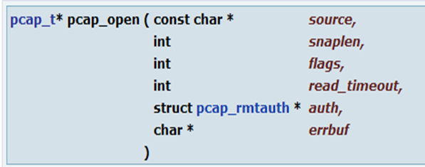

如果使用Hub等基于共享的网络的情况下，网络上所有的机器都可以“听”到通过的流量，但对不属于自己的数据包则不予响应（换句话说，工作站A不会捕获属于工作站B的数据，而是简单地忽略这些数据）。如果某个工作站的网络接口处于**混杂模式**，那么它就可以捕获网络上所有的数据包和帧。 

但是现代网络常常采用交换机作为网络连接设备枢纽，在通常情况下，交换机不会让网络中每一台主机侦听到其他主机的通讯，因此在这时采用**网络端口镜像技术**进行配合。


### 过滤数据包

pcap_compile( )它将一个高层的布尔过滤表达式编译成一个能够被过滤引擎所解释的低层的字节码。

pcap_setfilter( )将一个过滤器与内核捕获会话相关联。所有的符合要求的数据包 (即那些经过过滤器以后，布尔表达式为真的包) ，将会立即复制给应用程序。

```c
int pcap_compile ( pcap_t * p,
                  struct bpf_program * fp,
                  char * str,
                  int optimize,
                  bpf_u_int32 netmask
                 )
功能:编译过滤规则
输入参数：
    str规则串;     optimize是否优化; netmask可以设为0(used only when checking for IPv4 broadcast addresses)
返回：
    失败：返回-1。(可以使用pcap_geterr() 获取错误信息)

        
int pcap_setfilter ( pcap_t * p,
                                struct bpf_program * fp
                              )
功能:设置过滤器规则
输入参数：
           fp为指到结构体 bpf_program 的指针， pcap_compile()函数返回的参数。
返回：
           失败：返回-1。
```


### 捕获数据包

WinPcap和Libpcap的最强大的特性之一，是拥有过滤数据包的引擎。 

适配器打开以后，捕获工作就可以用pcap_dispatch()或pcap_loop()进行

```c
Int pcap_loop (
                     pcap_t *p, 
                     int cnt, 
                     pcap_handler callback, 
                     u_char *user
				)
```

 功能:循环抓取网络数据报文直到处理完cnt个数据报文。每捕获到一个报文就调用用户设定的callback函数。

 请注意，使用 pcap_loop()函数捕获数据包时, 应用程序不能直接控制数据包处理函数的调用,因为这个包处理函数是自动由包捕获驱动程序调用的. 在某些情况下，使用循环调用pcap_next_ex()来接受数据包会更容易理解,它每一次调用只获取一个数据包。

```c
int pcap_next_ex ( pcap_t * p,
                            struct pcap_pkthdr ** pkt_header,
                            const u_char ** pkt_data )
```


### 发送数据包

#### 发送单个数据包

使用 pcap_sendpacket( )发送单个数据包

打开适配器以后，调用 pcap_sendpacket( )来发送手工制作的数据包。

**注意，数据将直接发送到网络，而不会进行任何加工和处理。这就意味着应用程序需要创建一个正确的协议首部。** 

#### 发送多个数据包—发送队列中的包

可以调用pcap_sendqueue_alloc()来创建一个队列
然后调用pcap_sendqueue_queue() 来向队列中加入一个包
最后调用pcap_sendqueue_transmit()来将队列发送出去.
调用 pcap_sendqueue_destroy()来删除一个队列


### 收集并统计网络流量

①通过名字打开一个设备[pcap_open]

②通过第4个参数read_timeout来设置统计的时间间隔

③设置filter[[pcap_compile](file:///C:/Program Files/Microsoft Visual Studio/WpdPack/docs/html/group__wpcapfunc.html), [pcap_setfilter](file:///C:/Program Files/Microsoft Visual Studio/WpdPack/docs/html/group__wpcapfunc.html)] (可选)

④设置设备为统计模式[ pcap_setmode(MODE_STAT);]

⑤开始统计，pcap_loop/pcap_dispatch()

⑥在回调函数中的参数中就包含了统计信息


### 实验一代码

```c
#define _W64
#define HAVE_REMOTE

#include <stdio.h>
#include <pcap.h>


void packet_handler(u_char*user,const struct pcap_pkthdr *header, const u_char *pkt_data)
{
	struct tm*ltime;
	char timestr[16];
	time_t local_tv_sec;
	local_tv_sec = header->ts.tv_sec;
	ltime=localtime(&local_tv_sec);
	strftime( timestr, sizeof timestr, "%H:%M:%S",ltime);
	printf("%s,len:%d\n\n", timestr,header->len);
}

void main(){
	pcap_if_t *alldevs;
	pcap_if_t *d;
	int i=0;
	char errbuf[PCAP_ERRBUF_SIZE];
	if (pcap_findalldevs_ex(PCAP_SRC_IF_STRING,NULL ,&alldevs, errbuf) == -1){
		fprintf(stderr,"Error in pcap_findalldevs_ex: %sin", errbuf);
		exit(1);
	}
	for(d= alldevs;d != NULL;d= d->next){
		printf("%d.%s",++i, d->name);
		if (d->description){
			printf(" (%s)\n",d->description);
		}else{
			printf(" (No description available)\n");
		}
	}
	if (i == 0){
		printf("\nNo interfaces found! Make sure WinPcap is installed.in");
		return;
	}
	
	int inum;
	printf("\nInput:");
	scanf("%d",&inum);

	pcap_t *adhandle;
	for(d=alldevs,i=0;i<inum-1;d=d->next,i++); 
	if ( (adhandle= pcap_open(d->name,
						65536,
						PCAP_OPENFLAG_PROMISCUOUS,
						1000,
						NULL,
						errbuf
						))==NULL)
	{
		fprintf(stderr,"\nUnable to open the adapter.%s is not supported by WinPcap\n",d->name);
		pcap_freealldevs(alldevs); 
		return ;
	}
	printf("\nlistening on %s... \n", d->description);

	pcap_loop(adhandle,0, packet_handler, NULL);

	pcap_freealldevs(alldevs); 
}
```


### 总结

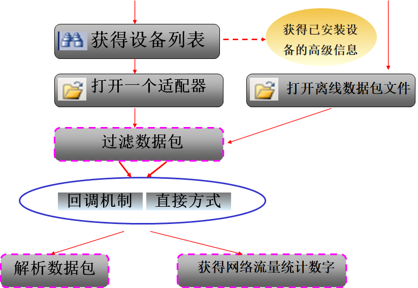


## 第二章


### MAC

适配器从网络上每收到一个 MAC 帧就首先用硬件检查 MAC 帧中的 MAC 地址.

如果是发往本站的帧则收下，然后再进行其他的处理。

否则就将此帧丢弃，不再进行其他的处理。

发往本站的帧包括以下三种帧：

1. 单播帧（一对一）

2. 广播帧（一对全体）

3. 多播帧（一对多）


### MAC 标准

两种标准：

1. DIX Ethernet V2 标准

2. IEEE 的 802.3 标准

最常用的 MAC 帧是以太网 V2 的格式


### MAC 帧格式

当数据字段的长度小于 46 字节时，

应在数据字段的后面加入整数字节的填充字段，

以保证以太网的 MAC 帧长不小于 64 字节。


在帧的前面插入的 8 字节中的第一个字段共 7 个字节，

是前同步码，用来迅速实现 MAC 帧的比特同步。

第二个字段是帧开始定界符，表示后面的信息就是MAC 帧。


### 无效的 MAC 帧

1. 帧的长度不是整数个字节；

2. 用收到的帧检验序列 FCS 查出有差错；

3. 数据字段的长度不在 46 ~ 1500 字节之间。

4. 有效的 MAC 帧长度为 64 ~ 1518 字节之间。

对于检查出的无效 MAC 帧就简单地丢弃。以太网不负责重传丢弃的帧。 


### MAC帧相关代码

```c
// send
// wpcap_4.cpp : Defines the entry point for the console application.
//

#include "stdafx.h"


//#include <stdlib.h>
//#include <stdio.h>

#define _W64
#include <pcap.h>


void main(int argc, char **argv)
{
	pcap_t        *fp;
	char           errbuf[PCAP_ERRBUF_SIZE];
	u_char         packet[100];
	int            i;
	char           continueOrNot;
	
    /* 检查命令行参数的合法性 */
    if (argc != 2)
    {
        printf("usage: %s interface (e.g., rpcap://DEVICENAME. DEVICENAME can be obtained through pcap_findalldevs_ex())\n", 
			      argv[0]);
        return;
    }

	printf("please input the MAC address of the target host to which you want to send your message: \n");
    for (i=0;i<6;i++)
    {
		scanf("%x", &packet[i]);
	}
	printf("The MAC address you've enetered is: \n");
    for (i=0;i<6;i++)
    {
		printf("%x ", packet[i]);
	}
	printf("\n");
    
    /* 打开输出设备 */
    if ( (fp= pcap_open(argv[1],            // 设备名
		100,                // 要捕获的部分 (只捕获前100个字节)
		0,                  // 不是混杂模式
		1000,               // 读超时时间, read timeout in milliseconds.
		NULL,               // 远程机器验证
		errbuf              // 错误缓冲
		) ) == NULL)
    {
        fprintf(stderr,"\nUnable to open the adapter. %s is not supported by WinPcap\n", argv[1]);
        return;
    }
    
    /* 设置MAC源地址为 2:2:2:2:2:2 */
	// 54-E1-AD-D7-E4-CA
    packet[6]=54;
    packet[7]=E1;
    packet[8]=AD;
    packet[9]=D7;
    packet[10]=E4;
    packet[11]=CA;

	/* protocol type part */
	packet[12] = 0x11;
    packet[13] = 0x12;
    
    /* 填充剩下的内容 */
    for(i=14;i<100;i++)
    {
        packet[i]=0;
    }

	while (1)
	{
	    printf("please input the message that you want to send to the target host: \n");
	    scanf("%85s", &packet[14]);
	
        /* 发送数据包 */
        if (pcap_sendpacket(fp, packet, 100 /* size */) != 0)
		{
            fprintf(stderr,"\nError sending the packet: \n", pcap_geterr(fp));
            return;
		}
		
		scanf("%c",&continueOrNot);
		printf("Continue to send next message?(Y or N)\n");
		scanf("%c", &continueOrNot);
		if (continueOrNot == 'N' || continueOrNot == 'n')
		{
            break;
		}		
	}
	
    return;
}
```

```c
// recieve
// ether_receive.cpp : Defines the entry point for the console application.

#include "stdafx.h"

#define _W64

#include "pcap.h"

/* packet handler 函数原型 */
void packet_handler(u_char *param, const struct pcap_pkthdr *header, const u_char *pkt_data);

int main(int argc, char **argv)
{
	int i=0;
	pcap_t *adhandle;
	char errbuf[PCAP_ERRBUF_SIZE];
    
    /* 检查命令行参数的合法性 */
    if (argc != 2)
    {
        printf("usage: %s interface (e.g., rpcap://DEVICENAME. DEVICENAME can be obtained through pcap_findalldevs_ex())\n", 
			argv[0]);
        return -1;
    }
    
    /* 打开设备 */
    if ( (adhandle= pcap_open(argv[1],          // 设备名
		65536,            // 65535保证能捕获到不同数据链路层上的每个数据包的全部内容
		PCAP_OPENFLAG_NOCAPTURE_LOCAL  ,    // 不是混杂模式,PCAP_OPENFLAG_NOCAPTURE_LOCAL不抓自己产生的包(it seems does not work in my experiments.)
		1000,             // 读取超时时间
		NULL,             // 远程机器验证
		errbuf            // 错误缓冲池
		) ) == NULL)
    {
        fprintf(stderr,"\nUnable to open the adapter. %s is not supported by WinPcap\n", argv[1]);
        /* 释放设备列表 */
        return -1;
    }
    
    printf("\nlistening on %s...\n", argv[1]);
    
    /* 释放设备列表 */
    
    /* 开始捕获 */
    pcap_loop(adhandle, 0, packet_handler, NULL);
    
    return 0;
}


/* 每次捕获到数据包时，libpcap都会自动调用这个回调函数 */
void packet_handler(u_char *param, const struct pcap_pkthdr *header, const u_char *pkt_data)
{
    struct tm          *ltime;
    char                timestr[16];
    time_t              local_tv_sec;
	unsigned int        i;

	if (pkt_data[12]==0x11&&pkt_data[13]==0x12)           /* Value of the type field */
	{
        printf("Message recevied: \n%s\n",pkt_data+14);
		
		printf("Original Info. of the packet:\n");
		/* 将时间戳转换成可识别的格式 */
		local_tv_sec = header->ts.tv_sec;
		ltime=localtime(&local_tv_sec);
		strftime( timestr, sizeof timestr, "%H:%M:%S", ltime);
		
		printf("\n%s,%.6d len:%d\n", timestr, header->ts.tv_usec, header->len);
		for (i=0;i<header->caplen;i++)
		{
			if (i%16==0)
			{
				printf("\n");
			}
			printf("%02X ", pkt_data[i]);
		}
	}
}
```


### PPPOE协议

**定义**

**PPPOE协议提供了在广播式的网络（如以太网）中多台主机连接到远端的访问集中器（Access Concentrator, AC, 也称为宽带接入服务器）上的一种标准。**

**特点**

1. 所有用户的主机都需要能独立的初始化自已的PPP协议栈，而且通过PPP协议本身所具有的一些特点，能实现在广播式网络上对用户进行计费和管理。

2. 需要每个主机与访问集中器之间能建立唯一的点到点的会话。


### PPPOE 协议两个阶段

**PPPOE的发现阶段（PPPOE Discovery Stage）**
**PPPOE的会话阶段（PPPOE Session Stage）**
与PPP的会话过程是一样的，主要区别在于在PPP的数据报文前封装了PPPOE的报文头
**无论是哪一个阶段的数据报文最终会被封装成以太网的帧进行传送。**


### PPPOE 协议封装

以太网的帧格式

**所有的PPPOE的数据报文均是被封装在以太网的数据域（净载荷区）中传送的**

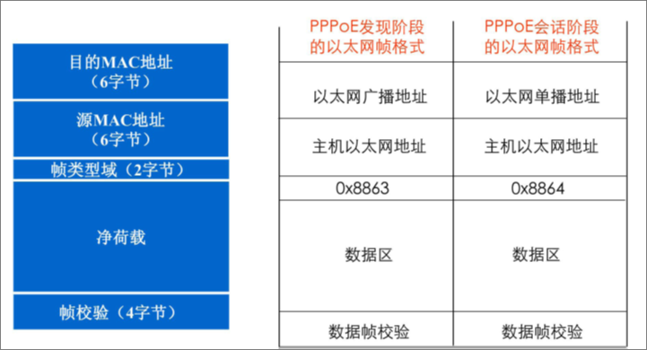


### PPPOE 报文格式

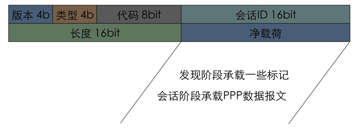

在PPPOE的不同阶段净载荷域内的数据内容会有很大的不同。

**在PPPOE的发现阶段时，该域内会填充一些Tag（标记）；而在PPPOE的会话阶段，该域则携带的是PPP的报文。**

跟在PPPoE长度字段后面的就是各种标记, 采用TLV(type-length-value)编码方式


### PPPOE 发现阶段

在发现阶段，用户主机与访问集中器双方获知**对方的MAC地址**和**唯一的会话ID号**，从而进入到下一个阶段（PPPOE的会话阶段）。

实际上双方在互相知道了对方的MAC地址后，就已经在广播式的网络上确定了一一对应关系，为了保证这个连接的有效性，同时使PPPOE协议能更加灵活的运用，因此还加入了会话ID字段，通过这两个条件就可完全确定双方点对点的关系。

**四个步骤：**

第一步，由用户侧首先发送一个PADI(PPPOE Active Discovery Initiation)报文。

第二步，由访问集中器发送一个PADO (PPPOE Active Discovery Offer)报文以回应各用户主机发送的PADI报文，**此时该PADO报文的以太网帧的源地址被填充为访问集中器的MAC地址，而目的地址则填充为从PADI中所获取的用户主机的MAC地址。**

第三步，是由用户主机向访问服务器发送单播的请求PADR（PPPOE Active Discovery Request）报文。

第四步，当访问集中器收到PADR报文时，就准备开始一个PPP的会话了。**而此时访问集中器会为这个会话分配一个唯一的会话ID，并在发送给主机的PADS（PPPOE Active Discovery Session-confirmation）报文中携带上这个会话ID。**

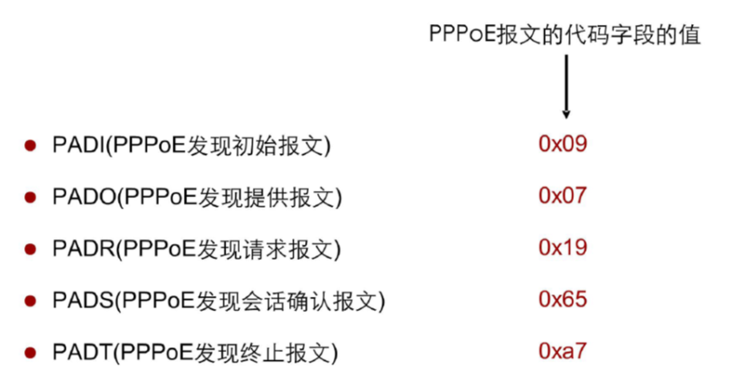


### PPPOE的发现阶段总结

在这个阶段一开始，由于接入用户并不知道访问集中器的MAC地址，所以需要广播机制来获取访问集中器的MAC地址。

首先由接入用户侧发起一个初始化的广播报文，对于访问集中器如果配置了PPPOE的业务时，它会实时检测网络上的数据包，当发现以太网数据帧中所承载的是PPPOE报文时（通过协议域的内容来区分），就会将其交给相应的模块去处理。

当收到初始化报文后，访问集中器会向该用户回应一个报文。如果网络上存在很多这样的访问集中器且都收到了用户侧发送的初始化报文时，它们也都会向用户侧会送一个确认报文，如果该用户收到这个报文后，则会依据报文中所携带的内容或本端的一些配置来选择一个唯一的访问集中器进行会话。

**到此时已完成了前两步了，那么剩下的两步则是协商一些所提供的服务选项和获取PPPOE会话阶段所必须的会话ID值。**


### PPPOE 会话过程

一旦PPPoE进入到会话阶段，则**PPP的数据报文**就会被填充在PPPoE的净载荷中被传送，**这时两者所发送的所有以太网包均是单目地址**。

 PPPoE净载荷里包含一个**无标志、地址、控制域**的PPP数据报文

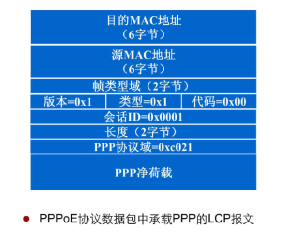


### PPP 协议

**现在全世界使用得最多的数据链路层协议是点对点协议 PPP (Point-to-Point Protocol)**。


### PPP 协议应满足的需求 

简单——这是首要的要求

封装成帧

透明性

多种网络层协议

多种类型链路

差错检测

检测连接状态

最大传送单元

网络层地址协商

数据压缩协商 


### PPP 协议不需要的功能

纠错

流量控制

序号

多点线路

半双工或单工链路


### PPP 协议的组成 

PPP 协议有三个组成部分：

一个将 IP 数据报封装到串行链路的方法。

链路控制协议 LCP (Link Control Protocol)。

网络控制协议 NCP (Network Control Protocol)。  


当 PPP 用在同步传输链路时，协议规定采用硬件来完成比特填充（和 HDLC 的做法一样）。

当 PPP 用在异步传输时，就使用一种特殊的字符填充法。


### PPP 协议的帧格式


PPP 有一个 2 个字节的协议字段：

当协议字段为 0x0021 时，PPP 帧的信息字段就是IP 数据报。

若为 0xC021, 则信息字段是 PPP 链路控制数据。

若为 0x8021，则表示这是网络控制数据。 


### PPP 协议的工作状态 

当用户拨号接入 ISP 时，路由器的调制解调器对拨号做出确认，并建立一条物理连接。

PC 机向路由器发送一系列的 LCP 分组（封装成多个 PPP 帧）。

这些分组及其响应选择一些 PPP 参数，和进行网络层配置，NCP 给新接入的 PC机分配一个临时的 IP 地址，使 PC 机成为因特网上的一个主机。

通信完毕时，NCP 释放网络层连接，收回原来分配出去的 IP 地址。接着，LCP 释放数据链路层连接。最后释放的是物理层的连接。  

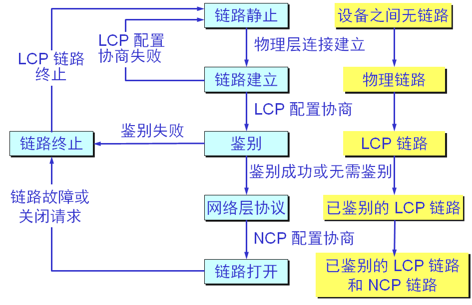


### PPP链路建立的过程

三个阶段：创建阶段、认证阶段和网络协商阶段。

#### 创建PPP链路

LCP负责创建链路。对基本的通讯方式进行选择。
链路两端设备通过LCP向对方发送配置信息报文（Configure Packets）。
配置成功信息包（Configure-Ack packet）被发送且被接收，进入了LCP开启状态。

#### 用户验证

客户端会将自己的身份发送给远端的接入服务器。
使用安全验证方式避免第三方窃取数据或冒充远程客户接管与客户端的连接。
在认证完成之前，禁止从认证阶段前进到网络层协议阶段。
如果认证失败，认证者应该跃迁到链路终止阶段。

这一阶段里，只有链路控制协议、认证协议，和链路质量监视协议的packets是被允许的。在该阶段里接收到的其他的packets必须被地丢弃。

**最常用的认证协议有口令验证协议（PAP）和挑战握手验证协议（CHAP）。**

#### 调用网络层协议
认证阶段完成之后，PPP将调用在链路创建阶段（阶段1）选定的网络控制协议（NCP）。选定的NCP解决PPP链路之上的高层协议问题，例如，在该阶段IP控制协议（IPCP）可以向拨入用户分配动态地址。


### LCP协议

**用来建立、配置、维护、终止一条点对点链路。**
LCP协议协商选项：

1. MRU，最大接收单元
2. 认证协议
3. 链路压缩
4. 多链路捆绑

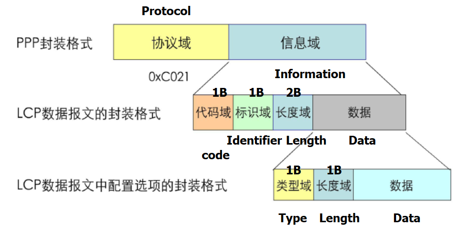


### NCP协议

**用来建立、配置不同的网络层协议。**包括IPCP、IPXCP等协议。
IPCP协议协商选项：

1. IP地址协商
2. TCP/IP头压缩


### IPCP协商过程--静态协商

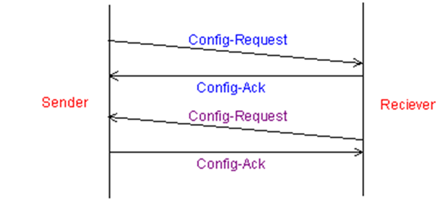

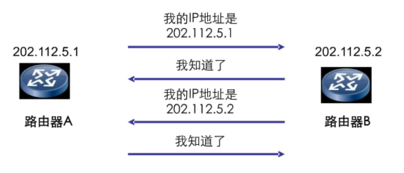


### IPCP协商过程—动态协商

动态协商，也即是一端配置为动态获取IP地址，另一端通过手动方式配置IP地址，且允许给对端分配IP地址。

这个过程实际上可与窄带拨号上网的过程相一致，如果我们想用计算机上网，均会安装一个拨号适配器，而且计算机中的拨号网络适配器是采用动态获取IP地址的方式。

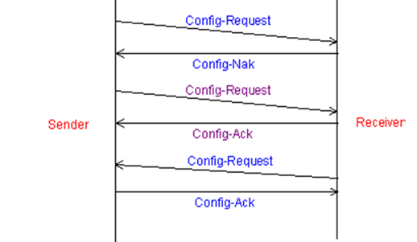

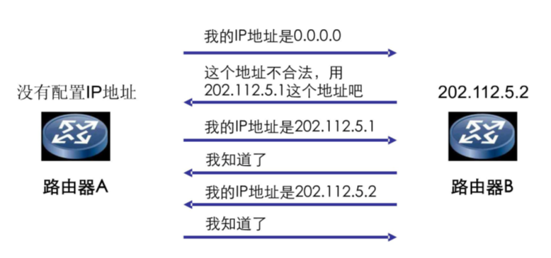


### PPP认证方式

口令验证协议（PAP）

PAP是一种简单的明文验证方式。

AC/NAS（网络接入服务器，Access Concentrator/Network Access Server）要求用户提供用户名和口令，PAP以明文方式返回用户信息。

PAP是两次握手认证协议，口令以明文传送，被认证方首先发起认证请求。


### CHAP认证

CHAP是三次握手认证协议，不发送口令，主认证方首先发起认证请求，安全性比PAP高。

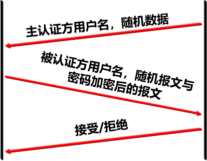


## 第三章


### IP 数据报的格式

一个 IP 数据报由首部和数据两部分组成。

**首部的前一部分是固定长度，共 20 字节，是所有 IP 数据报必须具有的。**

在首部的固定部分的后面是一些可选字段，其长度是可变的(不超过40字节)。


总长度——占 16 位，指首部和数据之和的长度，单位为字节，因此数据报的最大长度为 65535 字节


标志(flag)  占 3 位，目前只有两位有意义。标志字段的最低位是 **MF** (More Fragment)。

MF = 1 表示后面“还有分片”。

MF = 0 表示最后一个分片。

标志字段中间的一位是 **DF** (Don't Fragment) 。只有当 DF = 0 时才允许分片。


片偏移(占13 位)指出：较长的分组在分片以后，某片在原分组中的相对位置。片偏移以 8 个字节为偏移单位。


### IP 数据报分片

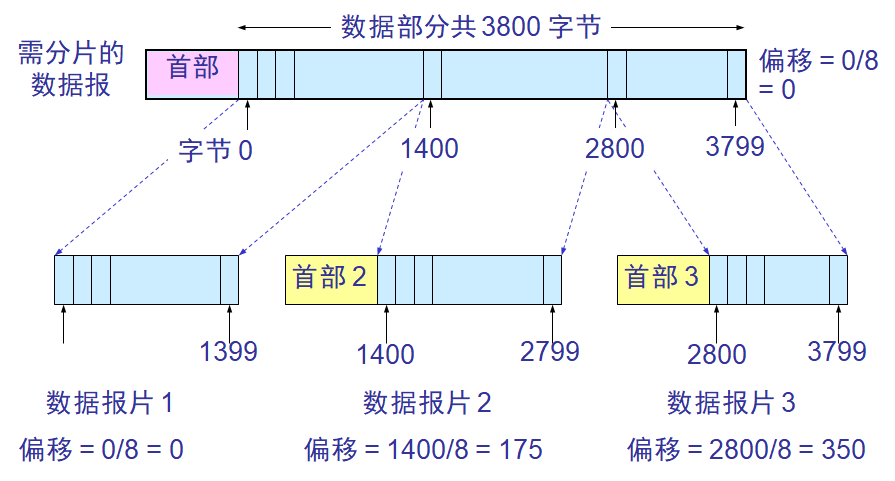

MTU： 最大传输单元，超过这个就要开始分片


### ARP

不管网络层使用的是什么协议，在实际网络的链路上传送数据帧时，最终还是必须使用硬件地址。 

每一个主机都设有一个 ARP 高速缓存(ARP cache)，里面有所在的局域网上的各主机和路由器的 IP 地址到硬件地址的映射表。

当主机 A 欲向本局域网上的某个主机 B 发送 IP 数据报时，就先在其 ARP 高速缓存中查看有无主机 B 的 IP 地址。如有，就可查出其对应的硬件地址，再将此硬件地址写入 MAC 帧，然后通过局域网将该 MAC 帧发往此硬件地址。 


### ARP 请求过程

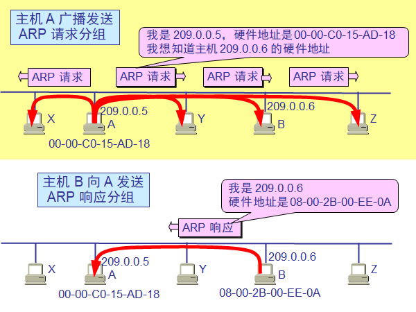


### ARP 高速缓存的作用

1. 为了减少网络上的通信量，主机 A 在发送其 ARP 请求分组时，就将自己的 IP 地址到硬件地址的映射写入 ARP 请求分组。

2. 当主机 B 收到 A 的 ARP 请求分组时，就将主机 A 的这一地址映射写入主机 B 自己的 ARP 高速缓存中。这对主机 B 以后向 A 发送数据报时就更方便了。 


### 使用 ARP 的四种典型情况 

1. 发送方是主机，要把IP数据报发送到本网络上的另一个主机。这时用 ARP 找到目的主机的硬件地址。 

2. 发送方是主机，要把 IP 数据报发送到另一个网络上的一个主机。这时用 ARP 找到本网络上的一个路由器的硬件地址。剩下的工作由这个路由器来完成。 

3. 发送方是路由器，要把 IP 数据报转发到本网络上的一个主机。这时用 ARP 找到目的主机的硬件地址。 

4. 发送方是路由器，要把 IP 数据报转发到另一个网络上的一个主机。这时用 ARP 找到本网络上的一个路由器的硬件地址。剩下的工作由这个路由器来完成。 


### ARP消息类型

1. ARP request ：  ARP请求 

2. ARP response ： ARP应答 


### ARP协议（报文格式）

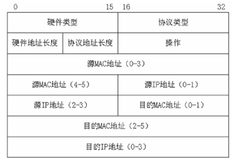

1. 硬件类型：以太网接口类型为1 

2. 协议类型：IP协议类型为0x0800 

3. 硬件地址长度：MAC地址长度为6(Bytes) 

4. 协议地址长度：IP地址长度为4(Bytes)

5. 操作：ARP请求为1，ARP应答为2 
6. 源MAC地址： (请求或应答报文)发送方的 MAC地址 
7. 源IP地址： (请求或应答报文)发送方的IP地址 
8. 目的 MAC 地址：ARP 请求中该字段没有意义；ARP应答中为(应答报文)接收方的MAC地址 
9. 目的 IP 地址：ARP请求中为请求解析的 IP 地址；ARP应答中为(应答报文)接收方的IP地址


### ARP欺骗攻击

用伪造源MAC地址发送ARP响应包，可以对ARP高速缓存机制进行攻击。

攻击者只要持续不断的发出伪造的ARP响应包就能更改目标主机ARP缓存中的IP-MAC条目，造成网络中断或中间人攻击。


### ARP响应包的伪造

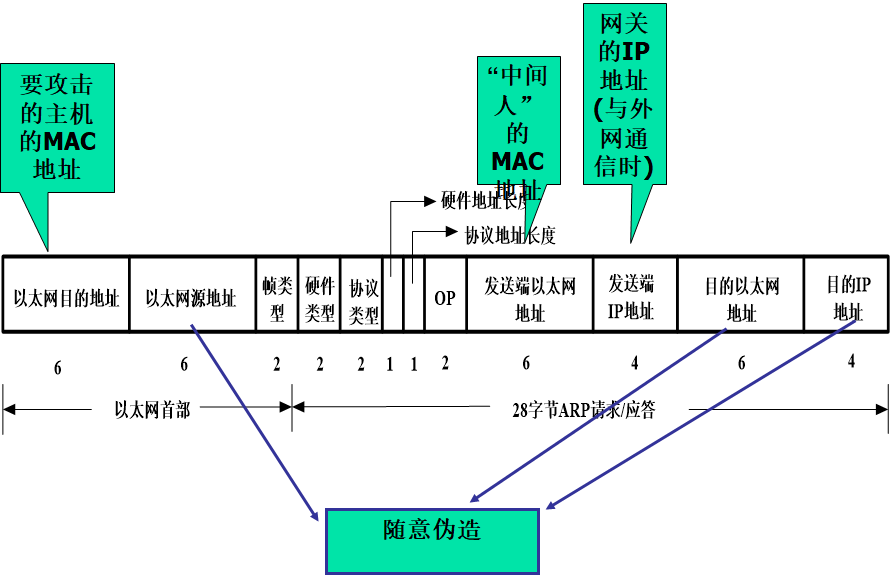


## 第四章


### TCP报文

首部20个字节。

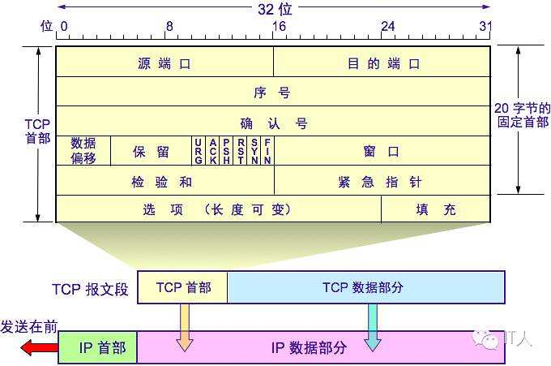

**1.端口号：**用来标识同一台计算机的不同的应用进程。

1）源端口：源端口和IP地址的作用是标识报文的返回地址。

2）目的端口：端口指明接收方计算机上的应用程序接口。

TCP报头中的源端口号和目的端口号同IP数据报中的源IP与目的IP唯一确定一条TCP连接。

**2.序号和确认号：**是TCP可靠传输的关键部分。序号是本报文段发送的数据组的第一个字节的序号。在TCP传送的流中，每一个字节一个序号。

e.g.一个报文段的序号为300，此报文段数据部分共有100字节，则下一个报文段的序号为400。所以序号确保了TCP传输的有序性。确认号，即ACK，指明下一个期待收到的字节序号，表明该序号之前的所有数据已经正确无误的收到。确认号只有当ACK标志为1时才有效。比如建立连接时，SYN报文的ACK标志位为0。

**3.数据偏移／首部长度：**4bits。由于首部可能含有可选项内容，因此TCP报头的长度是不确定的，报头不包含任何任选字段则长度为20字节，4位首部长度字段所能表示的最大值为1111，转化为10进制为15，15*32/8 = 60，**故报头最大长度为60字节。首部长度也叫数据偏移，是因为首部长度实际上指示了数据区在报文段中的起始偏移值。**

**4.保留：**为将来定义新的用途保留，现在一般置0。

**5.控制位：**URG  ACK  PSH  RST  SYN  FIN，共6个，每一个标志位表示一个控制功能。

1）URG：紧急指针标志，为1时表示紧急指针有效，为0则忽略紧急指针。

2）ACK：确认序号标志，为1时表示确认号有效，为0表示报文中不含确认信息，忽略确认号字段。

3）PSH：push标志，为1表示是带有push标志的数据，指示接收方在接收到该报文段以后，应尽快将这个报文段交给应用程序，而不是在缓冲区排队。

4）RST：重置连接标志，用于重置由于主机崩溃或其他原因而出现错误的连接。或者用于拒绝非法的报文段和拒绝连接请求。

5）SYN：同步序号，用于建立连接过程，在连接请求中，SYN=1和ACK=0表示该数据段没有使用捎带的确认域，而连接应答捎带一个确认，即SYN=1和ACK=1。

6）FIN：finish标志，用于释放连接，为1时表示发送方已经没有数据发送了，即关闭本方数据流。

**6.窗口：**滑动窗口大小，用来告知发送端接受端的缓存大小，以此控制发送端发送数据的速率，从而达到流量控制。窗口大小时一个16bit字段，因而窗口大小最大为65535。

**7.校验和：**奇偶校验，此校验和是对整个的 TCP 报文段，包括 TCP 头部和 TCP 数据，以 16 位字进行计算所得。由发送端计算和存储，并由接收端进行验证。

**8.紧急指针：**只有当 URG 标志置 1 时紧急指针才有效。紧急指针是一个正的偏移量，和顺序号字段中的值相加表示紧急数据最后一个字节的序号。 TCP 的紧急方式是发送端向另一端发送紧急数据的一种方式。

9.选项和填充：最常见的可选字段是最长报文大小，又称为MSS（Maximum Segment Size），每个连接方通常都在通信的第一个报文段（为建立连接而设置SYN标志为1的那个段）中指明这个选项，它表示本端所能接受的最大报文段的长度。选项长度不一定是32位的整数倍，所以要加填充位，即在这个字段中加入额外的零，以保证TCP头是32的整数倍。

10.数据部分： TCP 报文段中的数据部分是可选的。在一个连接建立和一个连接终止时，双方交换的报文段仅有 TCP 首部。如果一方没有数据要发送，也使用没有任何数据的首部来确认收到的数据。在处理超时的许多情况中，也会发送不带任何数据的报文段。


### TCP 建立连接的过程

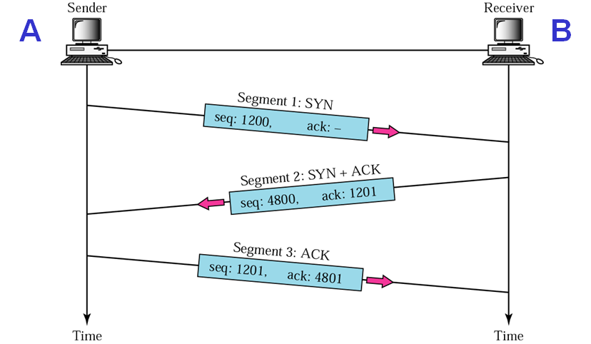


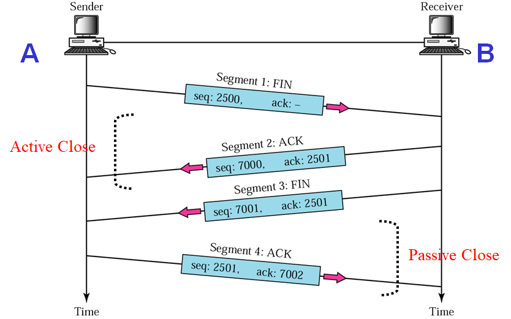


### UDP

UDP 是无连接的，即发送数据之前不需要建立连接。

UDP 使用尽最大努力交付，即不保证可靠交付，同时也不使用拥塞控制。

UDP 是面向报文的。UDP 没有拥塞控制，很适合多媒体通信的要求。 

UDP 支持一对一、一对多、多对一和多对多的交互通信。

UDP 的首部开销小，只有 8 个字节。 


### UDP 报文

用户数据报 UDP 有两个字段：数据字段和首部字段。

首部字段有 8 个字节，由 4 个字段组成，每个字段都是两个字节。

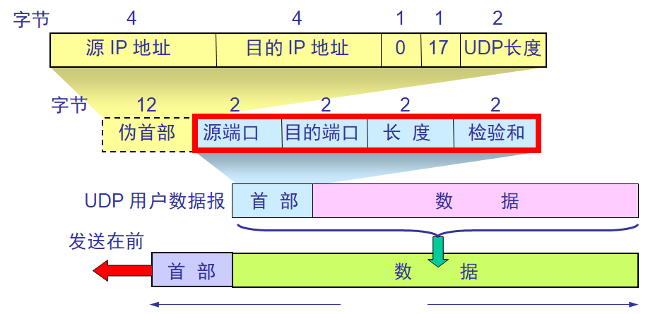

在计算检验和时，临时把“伪首部”和 UDP 用户数据报连接在一起。伪首部仅仅是为了计算检验和。

