# 无线网络技术


## 第一章


### 计算机网络的发展历史

出现之前：电话网络

诞生阶段：分时系统

形成阶段：ARPANET

互联互通阶段：Internet

高速网络阶段：光纤网络等

无线网络和物联网阶段：泛在网络（Ubiquitous/Pervasive）

 

### 计算机网络技术

**网络体系结构**

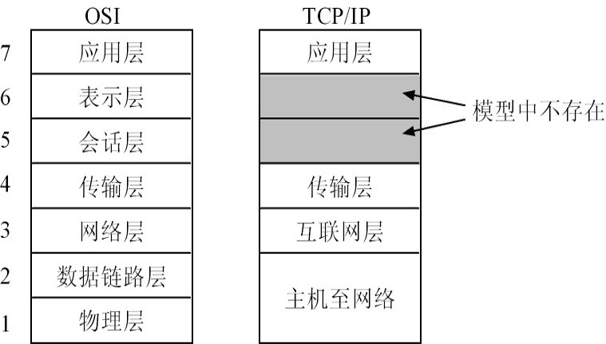

**网络体系结构的主要研究内容**

网络 = 硬件设备 + 软件

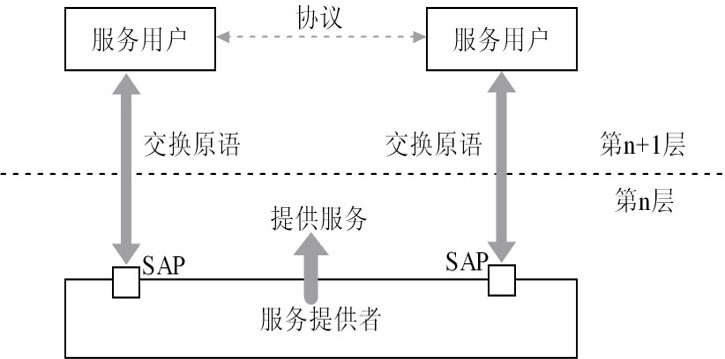


**网络体系结构的软件部分**

协议：对等实体间的一套约定；

分层：每一层对应一个或多个协议；

层与层之间有接口，下层协议向上层协议提供服务；

一套协议被称为一个协议栈；


### 无线网络技术的发展历史

二战时期，美国陆军的无线传输实验

1945年，英国人克拉克提出静止卫星通信的设想

1947年，美国贝尔实验室提出了蜂窝通信的概念

1954年，美国海军利用月球表面对无线电波的反射进行了地球上两地电话传输试验

1960年，人类第一颗人造地球通信卫星，美国宇航局兰利研究中心的工程师制造“回声1号”并成功发射

 

### 无线网络的分类

#### 分类标准

1. 使用的频率

2. 是否需要基础设施支持

3. 覆盖范围

4. 参与组网的对象
5. 技术特点

#### 按覆盖范围划分

无线个域网

​    蓝牙(Bluetootn)和Zigbee、无线超宽带(Ultra Width Band)

无线局域网

​    WiFi

无线城域网

​    全球微波互联接入(WiMAX)

无线广域网

​    蜂窝技术、卫星网络


### 蜂窝结构来完成一定区域的网络覆盖

大蜂窝（Megacell）：以卫星作为基站，单个基站覆盖距离可达上千千米

宏蜂窝（Macrocell）：基站放置在高大建筑上，单个基站覆盖距离1~10千米

微蜂窝（Microcell）：基站放置在几米到几十米高度上，覆盖范围几百米~1千米

微微蜂窝（Picocell）：毫微微蜂窝（Femtocell）：基站往往布置在室内，用于改善室内信号覆盖较弱的问题。


### 无线电频率分配是受管束的

FCC即美国联邦通讯委员会

中国无线电管理局


### 无线网络领域的标准化组织

* ITU（International Telecommunication Union）

  国际电信联盟，电信领域中最有影响的组织

* ISO（International Standard Organization）

  国际标准化组织

* IEC （International Electrical Commission）

  国际电工协会

* IEEE（Institute of Electrical and Electronics Engineers）

  电气和电子工程师协会，世界上最大的专业技术组织之一，IEEE定义的标准在工业界有极大的影响

* IAB（Internet Architecture Board）

  Internet体系委员会

  

## 第二章


### 传输媒体

1. 定义：发送器与接收器之间的物理路径

2. 分类：导向性（有线）和非导向性（无线）

   

### 导向性与非导向性

对导向媒体而言，电磁波被引导沿某一固定媒体前进

非导向媒体的例子是大气和外层空间，它们提供了传输电磁波信号的手段，但不引导它们的传播方向，这种传输形式通常称为无线传播


### 频率

$$
c（光速）=λ（波长）*f（频率）
$$


### 频率对无线信号传输各方面的影响

1. 频率越高（波长越短），损耗越大，越难越过障碍物，穿透性越差，但传输方向性强，适合远距离传输。

   频率越低（波长越长），损耗越小，越容易越过障碍物，穿透性越好，但传输方向性弱，适合近距离传输。

2. 频率一定（波长一定），距离越远损耗越大。

3. 在导向性媒体中传播时，传输质量受传输媒体影响较大。

4. 在非导向性媒体中传播时，传输质量受带宽影响更大。


### 天线的作用

**天线是发射和接受无线电波必须的设备，用于将电磁波辐射到空间中或收集电磁波。**


###  天线的主要指标

天线有五个基本参数：

1. 方向性系数

2. 天线效率

3. 增益系数

4. 辐射电阻

5. 天线有效高度

这些参数是衡量天线质量好坏的重要指标。

**天线增益主要与天线有效面积有关。**


### 天线类型

抛物反射天线 

偶极天线


### 天线增益

主要与天线**有效面积**有关


G：增益

Ae：有效面积

f：载波频率

λ：载波波长

c：光速


### 半波偶级天线最佳长度计算

天线总长度是天线最有效传输信号波长的一半。
$$
L = λ/2 = c/2f
$$

```
// 例题
求2.4GHz 半波偶极天线的长度
因为c=λf (c：波传播速度,λ：波长,ν：频率)
    λ=c/f
     =300,000,000 m/s÷2.4 GHz
     =300,000,000 m/s÷2,400,000,000 Hz
     =0.125m
    
    L=λ/2=0.0625m
```


### 天线的分集技术(MIMO)

多入多出(Multiple Input Muliptle Output MIMO)

比如天线2x2代表两根发送天线与两根接收天线，多进多出是为极大地提高信道容量，在发送端和接收端都使用多根天线，在收发之间构成多个信道的天线系统。


### 数据与信号的相互转换

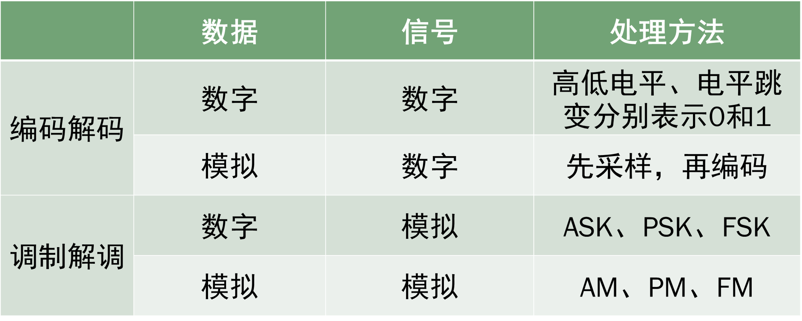

ASK：振幅键控

FSK：频移键控

PSK：移相键控

AM：调幅

PM：调相

FM：调频


### 采样定理

奈奎斯特定理

在进行模拟/数字信号的转换过程中，当采样频率fs.max大于信号中最高频率fmax的2倍时(即fs.max>2fmax)，采样之后的数字信号完整地保留了原始信号中的信息，一般实际应用中保证采样频率为信号最高频率的5～10倍。


### 卫星通信特点

优点：

范围大、距离远、不受地面灾害影响，建设快，费用和距离无关，广播和多址通信容易实现，同一信道可用于不同方向，不同区域的通信。

缺点：

信号传输时延大，有些频段受天气影响明显。天线受太阳辐射噪声影响，安全保密性较差，卫星造价高。


### 信号成功接收的条件

1. 接收端信号强度足够大
2. 信噪比足够大
3. 信号不能失真


### 信号损失

1. 衰减和衰减失真

   衰减：信号强度随信号在传输介质中传输距离的增加而下降的现象

2. 自由空间损耗

   无线信号在传播过程中的能量消耗

3. 噪声

   * 热噪声

   * 互调噪声

   * 串扰

   * 脉冲噪声

4. 大气吸收

   源于大气中的水蒸气和氧气分子

5. 多径

   由于无线环境中障碍物对信号的反射，接收方在不同时间先后收到同一信号的多个副本

6. 折射

   是造成多径现象、信号损耗的主要原因之一

7. 移动环境中的衰落

   反射、衍射、散射

8. 多普勒效应

   波在波源移向观察者时频率变高，而在波源远离观察者时频率变低

   

### 扩频技术

**定义：**

将携带信息的信号扩展到**较宽的带宽**中，以加大干扰和窃听的难度

**公式：**

香农公式 C=Blog2(1+S/N)

*B*是信道带宽（赫兹），*S*是信道内所传信号的平均功率（瓦），*N*是信道内部的高斯噪声功率（瓦）

**代表性的扩频方式：**

1. 跳频扩频（Frequency-hopping spread spectrum，FHSS）

2. 直接序列扩频（简称直序扩频，Direct-sequence spread spectrum，DSSS）

直接序列扩频采用全频带传送资料，速度较快。跳频扩频注重传输速率和稳定性。


### 复用与多址

**复用：多个信号使用同一信道互不干扰的同时传输**

* 频分复用（Frequency Division Multiplexing）

* 时分复用（Time Division Multiplexing）

* 码分复用（Code Division Multiplexing）

* 空分复用（Space Division Multiplexing）
* 正交频分复用（OFDM）

**多址：多点间进行多边通信**

* 频分多址（Frequency Division Multiple Access）

* 时分多址（Time Division Multiple Access）

* 码分多址（Code Division Multiple Access）

* 空分多址（Space Division Multiple Access）

  

### Hamming码

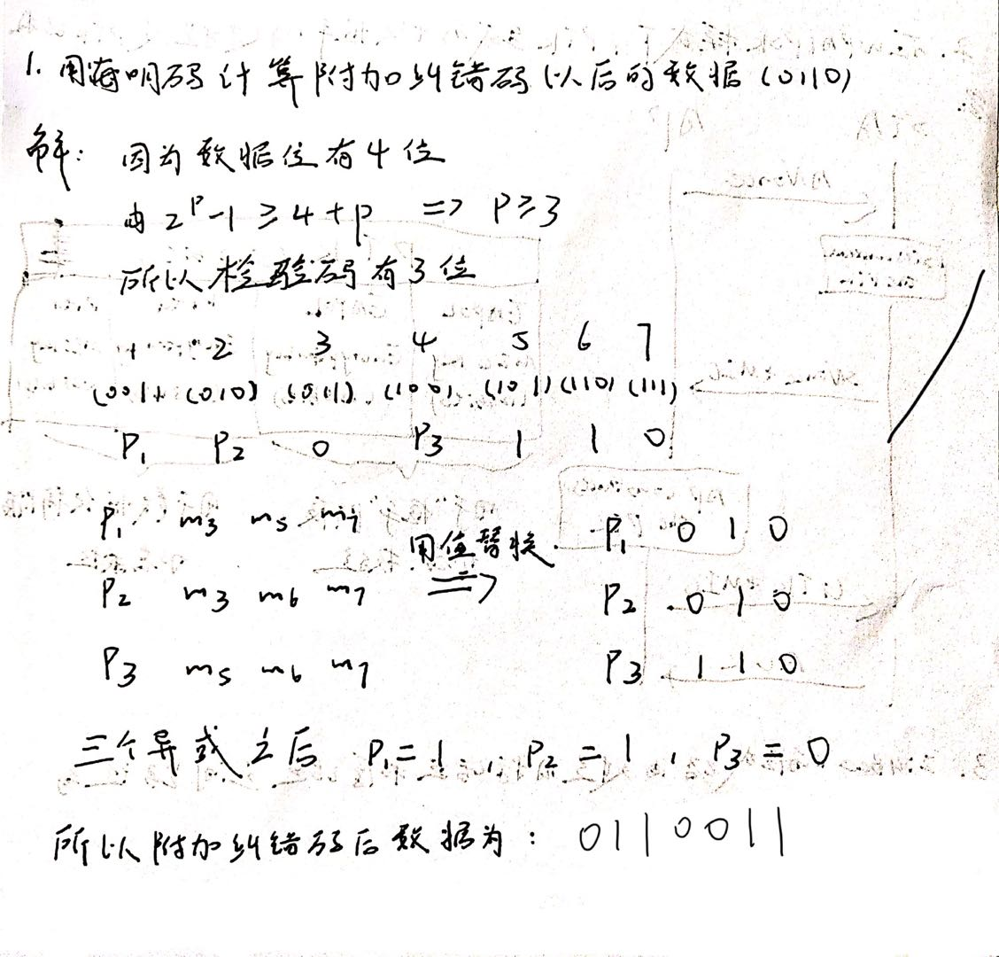


## 第三章


### 无线局域网与有线局域网对比

1. 移动性（Mobility）

   半移动

2. 灵活性（Flexibility）

   比有线网络高太多

3. 可伸缩性（Scalability）

   扩展容易

4. 经济性（Saving）

   相比有线网络更加便宜


### 无线局域网局限性

1. 干扰，不同的无线局域网间、其它同频无线通信

2. 可靠性（Reliability）

3. 带宽与系统容量，共享带宽

4. 安全性（Security and Safety）

   无线传输带来的安全挑战，以及电磁安全

5. 节能管理

6. 多业务与多媒体，QoS


### dBi、dBd和dBm

**dBi/dBd**

是功率增益单位

dBi参考基准是全向天线，dBd参考基准是偶极天线

**dBm**

是功率单位

miliwatt 毫瓦特


### dBm与mW的换算

1w=1000mw（10lg(1000)=30dBm）

0dBm=1mw （10lg(1)=0）

-10dBm=0.1mw（10lg（1/10）=-10）


###  无线局域网的组成

1. 站（Station, STA），一般是主机（Host）或终端（Terminal）

2. 无线介质（Wireless Medium, WM）

3. 基站（Base Station, BS）或接入点（Access Point, AP）

4. 分布式系统（Distribution System, DS）

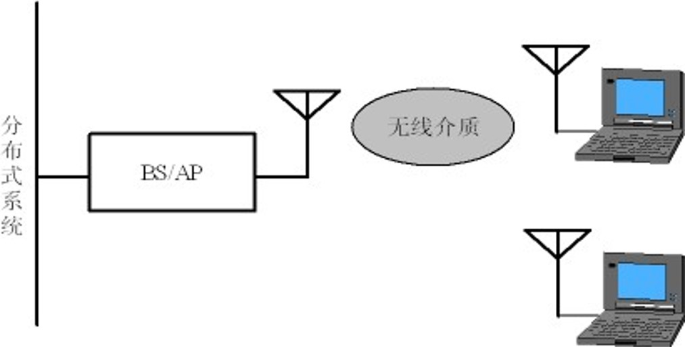


### 分布式系统

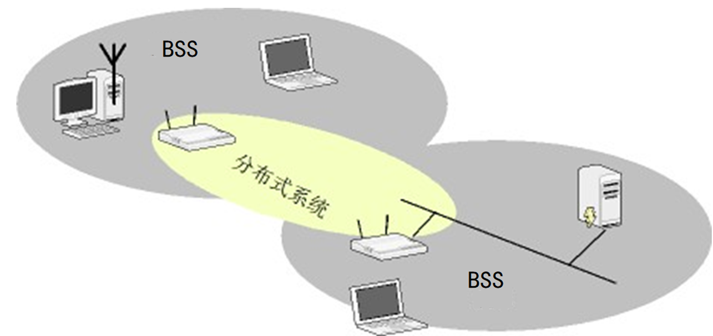


### 无线局域网的拓扑结构

#### 基础设施集中式拓扑

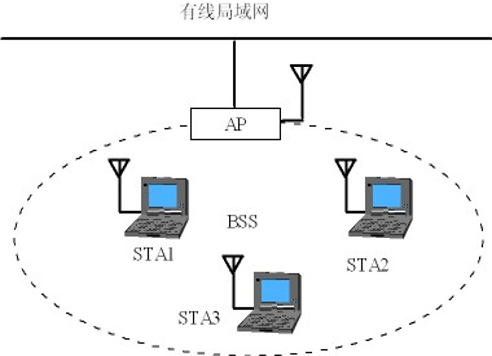

BSA: Basic Service Area

BSS: Basic Service Set

ESA: Extended Service Area

ESS: Extended Service Set


站（Station, STA）

接入点（Access Point, AP）

无线局域网的名称（SSID）

基本服务区BSA（Basic Service Area）

无线介质（Wireless Medium, WM）

基站（Base Station, BS）

分布式系统DS (Distribution System)

基本服务集BSS（Basic Service Set）

独立基本服务及IBSS

扩展服务集ESS（Extended Service Set）

扩展服务区ESA:（Extended Service Area）


#### 分布对等式拓扑结构

无AP存在

无法接入DS

站与站直接连接

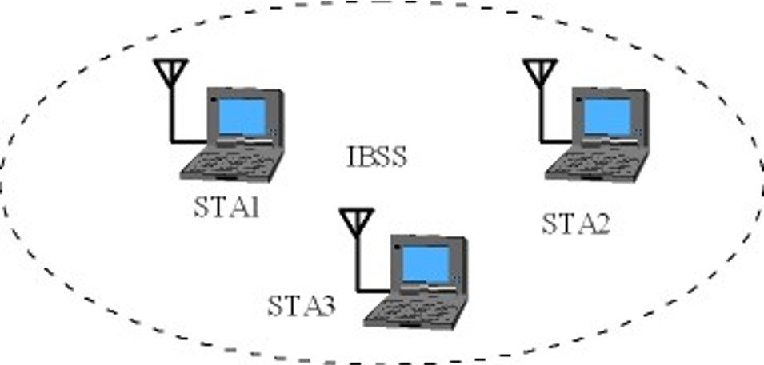


#### PC以对等方式组网

#### 中继型网络拓扑

中继：副路由广播主路由SSID

中继就是在两个无线点间把无线信号放大一次，使得远端的客户端可以接收到更强的无线信号

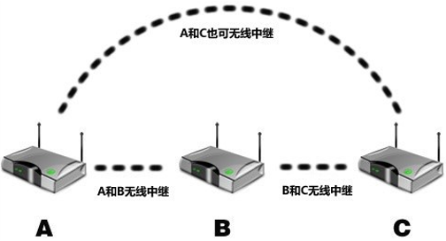

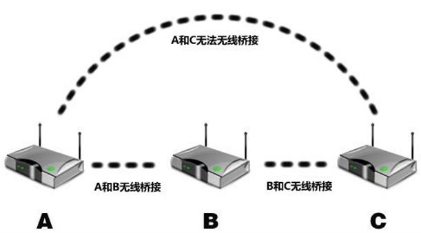

#### 桥接型网络拓扑

ESS: AP间通过DS实现无线中继、互联

桥接：副路由广播自身SSID

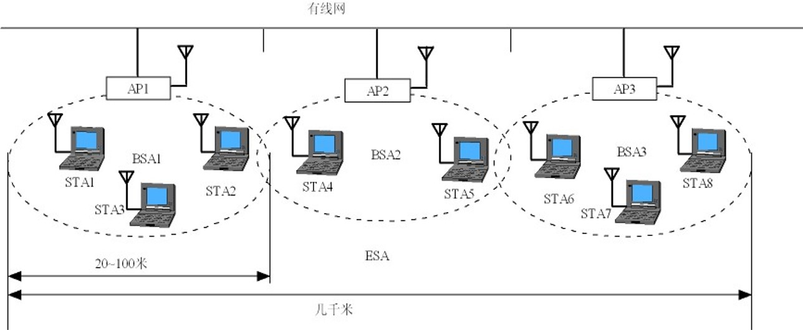


### 无线局域网的服务

#### STA服务

站（STA）需要运行的服务。

包括：

1. 认证
2. 解除认证
3. 保密
4. 数据传输

#### DSS服务

（Distributed System Service,分布式系统服务）

接入点（AP）需要运行的服务。

包括：

1. 连接
2. 重新连接
3. 解除连接
4. 分布(AP间无线互联)
5. 集成(AP与LAN互联)

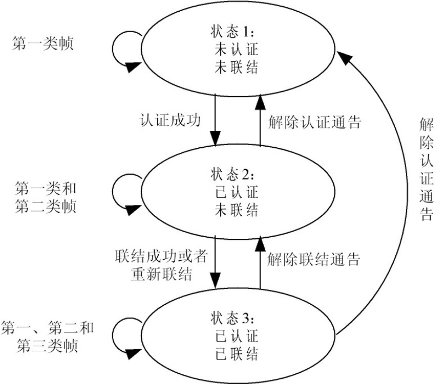


### 802.11各版本工作频率

802.11a是工作在5GHz的，有时候和其他版本号不能兼容

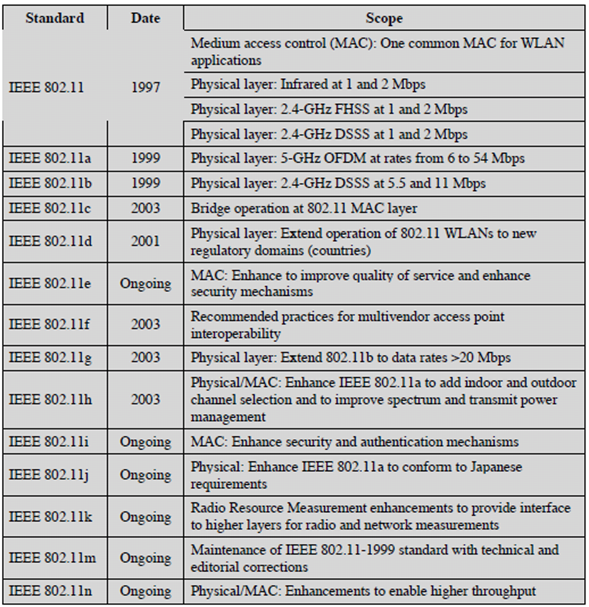


### 802.11 2.4G频段下信道划分


1-6-11、2-7-12、3-8-13信道之间的频率范围无重叠不干扰


### 802.11 MAC机制（DCF、RTS/CTS、CSMA/CD、二进制指数退避）

DCF：分布式协调，最基础的协调机制。

RTS/CTS：请求发送/准许发送

CSMA/CD：载波侦听/冲突检测

PCF：点协调

HCF：混合协调

二进制指数退避


### MIMO技术

MIMO技术是指能在不增加带宽的情况下，成倍地提高通信系统的容量和频谱利用率。

与之对应的是SISO。


### ISM频段

中文意思分别是**工业的**(Industrial)、**科学的**(Scientific)和**医学的**(Medical)，因此顾名思义ISM频段就是各国挪出某一段频段主要开放给[工业](https://zh.wikipedia.org/wiki/工业)，[科学](https://zh.wikipedia.org/wiki/科学)和[医学](https://zh.wikipedia.org/wiki/医学)机构使用。应用这些频段无需许可证或费用，只需要遵守一定的发射功率**（一般低于1W）**，并且不要对其它频段造成[干扰](https://zh.wikipedia.org/wiki/干扰)即可。

ISM频段在各国的规定并不统一。如在[美国](https://zh.wikipedia.org/wiki/美国)有三个频段902-928 MHz、2400-2483.5 MHz及5725-5850 MHz，而在[欧洲](https://zh.wikipedia.org/wiki/欧洲)900MHz的频段则有部分用于[GSM](https://zh.wikipedia.org/wiki/GSM)通信。

**而2.4GHz为各国共同的ISM频段。**因此无线局域网（IEEE 802.11b/IEEE 802.11g）、蓝牙、ZigBee等无线网络，均可工作在2.4GHz频段上。


### SSID

**SSID：**即无线网络的名字，是无线网络的唯一标识。

**BSSID：**BSSID 是指站点的 MAC 地址，（STA）在一个接入点，（AP）在一个基础架构模式，BSSID与BSSID的区别在于，BSSID其实就是MAC地址

**信道：**是指AP工作的频率。

**信道是怎么分的？**

大多数国家（包括中国）：1-13

日本：1-14

美国：1-11

1-6-11、2-7-12、3-8-13信道之间的频率范围无重叠不干扰

**无线AP（瘦AP）和无线路由器（胖AP），无线AP其本身是不能直接连通上网的，需要配合AC产品来使用的**


### 无线抓包与有线抓包的区别

除序号、时间等基本信息外，其余基本一样。


### 暴露终端和隐藏终端

隐藏终端问题可以简单定义为：节点之间无法互相监听对方。但当其不可以同时传输时，其同时传输，从而导致冲突发生。隐藏终端在单个AP（或者单个Receiver）时就有可能发生。RTS/CTS模式在协议层面解决隐藏终端问题。

暴露终端问题可以简单定义为：节点之间能够互相监听对方。但其可以同时传输时，其不传输，从而造成浪费。暴露终端在多个AP（或者多个Receiver）时才有可能发生。

 

### Wi-Fi安全

1. WEP: Wired Equivalent Protection/Wireless Encryption Protocol

2. WPA: Wi-Fi Protected Access

3. QSS: Quick Secure Setup

**安全性：WPA2 > WPA > WEP**


### WEP协议缺陷、加解密过程

缺陷：

1. 认证类型：开放系统与共享密钥

2. 四个密钥，但生效的只有一个

3. RC4算法不安全

4. 密钥长度：64位、128位与152位（其中，包含24位的IV）

5. IV（Initial Vector）以明文形式传送

6. 完整性校验方法：CRC

加解密过程：

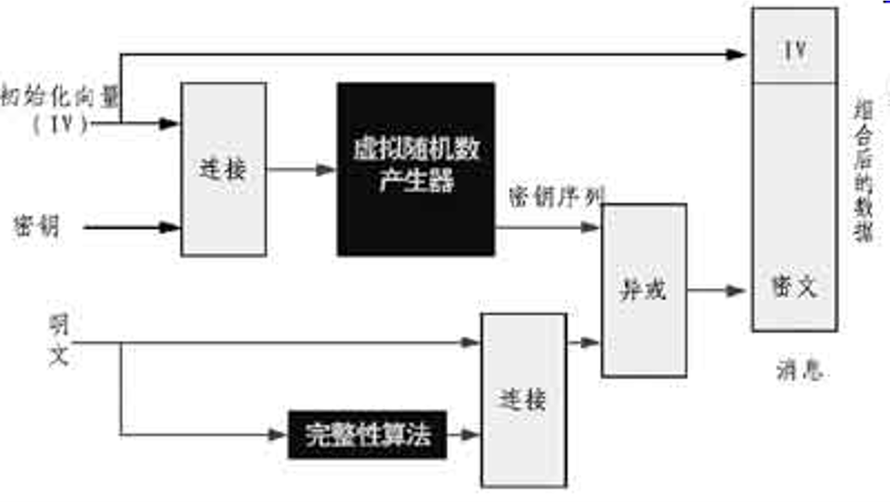

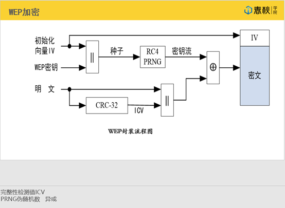


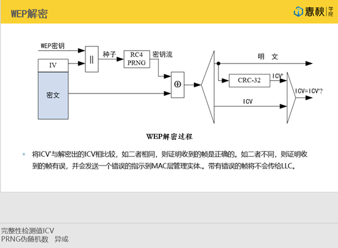


### PSK模式下的PTK生成与结构

**PTK/PSK：**

PSK预共享密钥  (Preshared Key) 256位

PTK临时对密钥（Pairwise Transient Key）512位

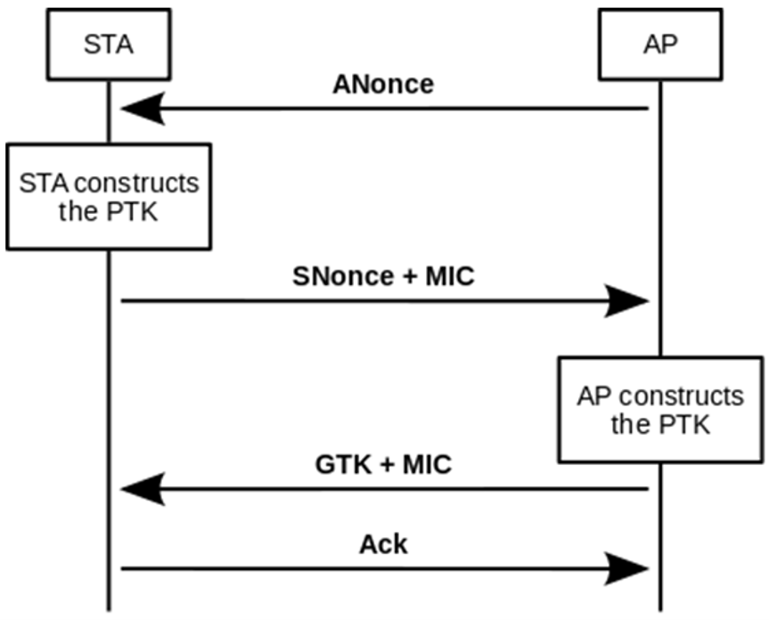

MIC：消息完整性验证

GTK：组临时密钥对

PTK结构：

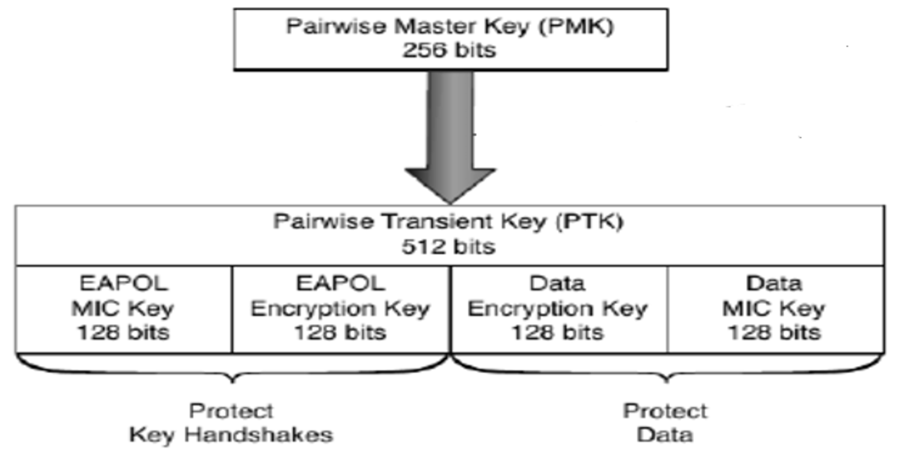


### AS模式与PSK模式的区别

1. WPA：仍然是RC4，采用TKIP（Temporary Key Integrity Protocol）模式

   WPA2：AES，且采用CCMP （Counter mode-CBC MAC Protocol）模式

2. AS模式取消了消息完整性密钥（MIC）
3. WPA2在消息加密时使用了计数器
4. WPA2和WPA数据包结构也有区别


### TKIP与CCMP的区别

数据帧格式

完整性校验方法

WPA：在WEP基础上增加了ICV（Integrity Check Value）和MIC（Message Integrity Check）

WPA2：只有MIC


### QSS PIN码

QSS是一种安全无线连接的配置方式

与WEP、WPA/WPA2相比，其并不涉及复杂的密钥生成、协商过程

其通过PIN码来验证设备合法性，若合法则建立WPA2级别的安全连接


QSS，即快速安全设置（Quick Secure Setup）

PIN（personal identification number ）是一串数字构成的通行码，用来认证使用者身份，授权他进入系统。PIN码是由8位数字构成的，并且第8位是前7位数字的校验和

破解8位PIN码只要试11000次（10的4次方+10的三次方）之内就可以绝对算出来


### WPA2相对WPA2的改进

认证方面： WPA采用的是802.1x+EAP的认证方式--通过第三方AAA服务器（Radius服务器）进行可扩展性认证协议，但WPA-PSK并没有采用这套机制，而是仍旧采用静态的共享密钥作为主要的认证方式，因此降低了破解工作的困难程度。

加密方面:   WPA采用了被称为“临时密钥完整性协议”（TKIP）的新认证/加密机制：利用Radius服务器的所分发的密钥作数据加密，但这个机制只存在于Enterprise模式下，对于WPA-PSK并不支持；另外，将密钥的头长度增加至48位，增加解密的难度，但由于其实际的加密方式仍旧是RC4，因此被破解的威胁仍然是存在的。

完整性方面: CCMP 既可以实现数据机密性（加密），又可以实现数据完整性 。

安全性：WPA2>WPA>WEP


### WAPI标准

**我国自主的Wi-Fi安全协议**

1. Wi-Fi只认证客户端

2. 采用非对称密码算法代替对称加密算法

3. 未能大规模应用，仅在保密要求较高的场合使用


### 加固WiFi网络

1. 控制发射功率

2. 关闭SSID广播

3. MAC地址过滤

4. 关闭DHCP与MAC地址绑定

5. 开启隔离

6. 关闭QSS

7. 管理密码强度

   

### Radiotap header

它包含了如信号强度、频率等信息。


## 第四章


### WiMAX

802.16协议簇

国际电信联盟（ITU）定义的4G标准：静态传输速率达到1Gbps，用户在高速移动状态下可以达到100Mbps，就可以作为4G的技术之一。为了达到上述峰值速率必须使用大于20MHz的带宽。

所以 WiMAX 可以作为4G技术。

​                                 

### WiMAX的拓扑结构


### WiMAX 的 QoS

#### QoS 概念

质量服务，Quality of Service

**是用来解决网络延迟和阻塞等问题的一种技术**

对特定的无时间限制的应用系统，比如Web应用，或E-mail设置无必要，对关键应用和多媒体应用需要。

当网络过载或拥塞时，QoS 能确保重要业务量不受延迟或丢弃，同时保证网络的高效运行

#### 优先级划分

1. 主动授予服务(Unsolicited Grant Service，UGS)：带宽固定，VoIP（Voice over IP）//周期性查询其带宽需求

2. 实时查询服务(Real-time Polling Service，RTPS)：带宽可变，视频流

3. 非实时查询服务(Non-Real-Time Polling Service，NRTPS)：带宽可变但有最低速率要求，FTP//非周期性查询其带宽需求

4. 尽力而为(Best Effort，BE) ：无质量保证，Internet网页浏览服务、电子邮件


### WiMAX的带宽分配方式

1. 用户设备通过请求/授予方式来获取媒体访问权力：GPC方式/GPSS方式

2. 由基站统一进行带宽资源的管理和分配


### TDD与FDD

TDD：时分双工(Time Division Duplexing)，收发共用一个射频频点，上、下行链路使用不同的时隙来进行通信

FDD：频分双工(Frequency Division Duplexing)，收发使用不同的射频频点来进行通信

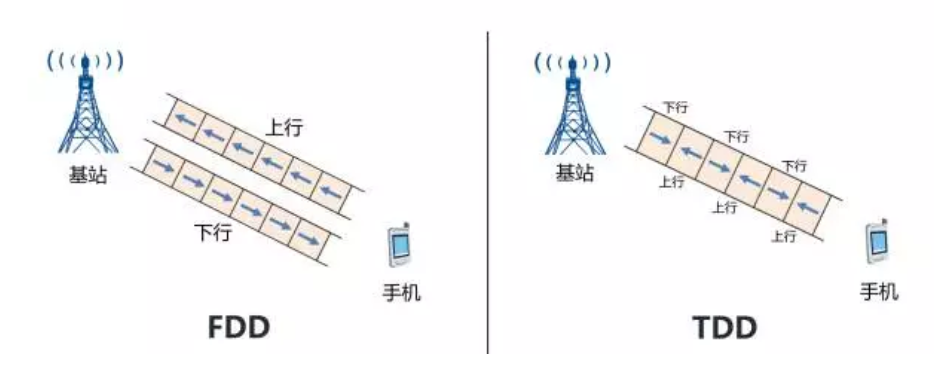

理论上讲，在相同的带宽条件下，比如FDD分配10M+10M，TDD分配20M，TDD的速率会低于FDD，这主要原因是TDD的帧结构中有个叫做特殊子帧的帧，这些帧会被浪费一部分（比如其中的保护时隙）并不传送任何数据，而FDD的帧不存在这种完全浪费掉的情况。

**三大运营商制式**

移动TDD（Time Division Duplex）

联通FDD （Frequency Division Duplex）

电信FDD（Frequency Division Duplex）


### 5G SA与NSA

NSA（Non-Standalone）：4G和5G混合组网

SA（Standalone）：5G独立组网


### 卫星网络配置

1. 点对点
2. 广播
3. 甚小天线地球站（Very Small Aperture Terminal）VSAT


### 蜂窝网络结构

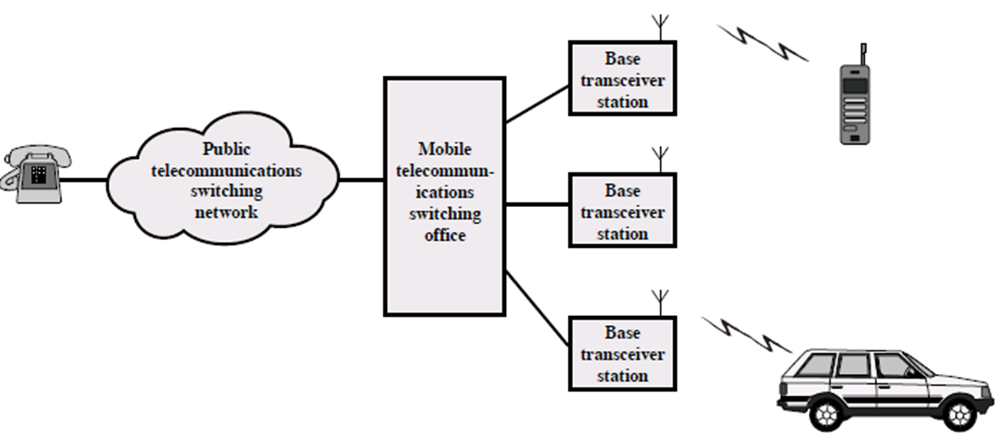

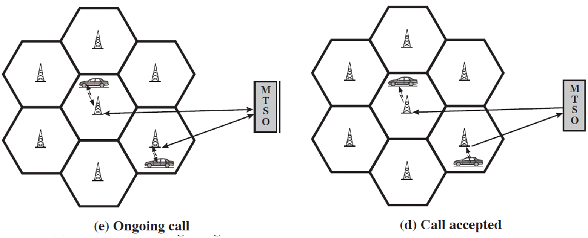

基站、移动电话交换局(MTSO)


### 无线城域网与无线广域网

无线城域网协议802.16单小区覆盖半径小于5KM

无线广域网协议802.20单小区覆盖半径约为15KM

定义上讲卫星通信、蜂窝电话都属于无线广域网的范畴


### 卫星上行下行不同频主要目的

首先距离遥远信号微弱，其次收与发路径相同，如果收和发同频，就可能造成干扰，继而增加了接收信号的处理难度


## 第五章


### UWB 技术特点

UWB (Ultra Width Band) 是超宽带无线技术的缩写。主要用于军用雷达、定位和通信系统中。通信速度可以达到几百Mbit/秒以上。

特点：

1. 频谱带宽高
2. 功率低
3. 数据传输量大


### ZigBee网络节点类型

**ZigBee网络组成：网络协调器、路由器、终端节点**

**拓扑结构：星形、树形、网状**

**网络协调器也就是网络的中心节点**

全功能设备（FFD， Full Function Device）也就是**网络中的路由或中继**

精简功能设备（RFD，Refined Function Device）也就是**网络中的终端节点**

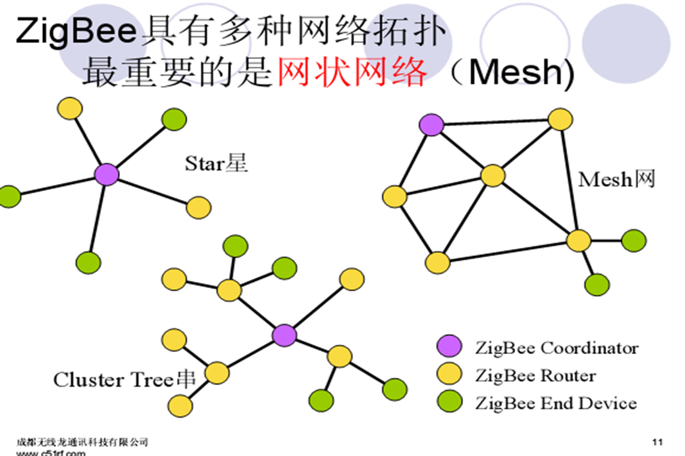


### ZigBee网络特点

**优点**

低功耗、低成本、短时延、高容量、高安全、免执照频段、低复杂度

**缺点**

低速率、近距离


### ZigBee路由

**响应式路由、按需路由**

AODV jr (Ad Hoc On-demand Distance Vector Routing Junior)

延时大、灵活性好

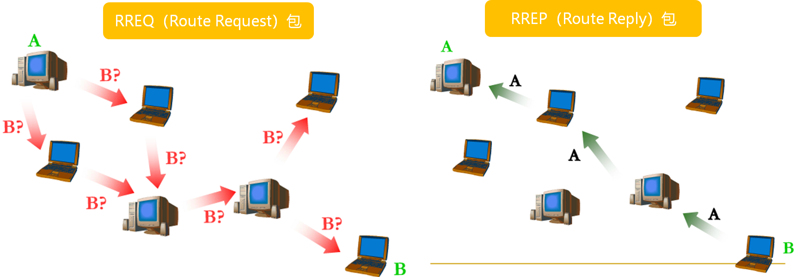

**混合式路由**

区域内采用按需方式建立路由

区域外采用表驱动方式建立路由


### 蓝牙网络组成

基本联网单元是微微网，由1台主设备（Master）+1~7台从设备（Slave）

**从设备仅可与主设备通信，且仅能在主设备授权的时间片内限时通信**

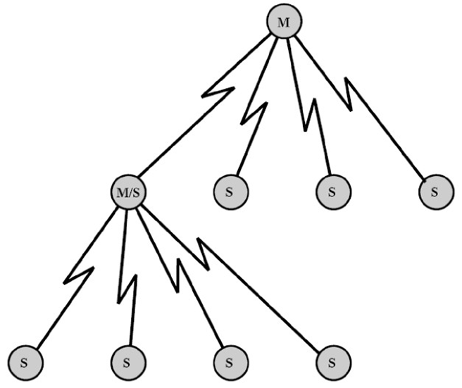

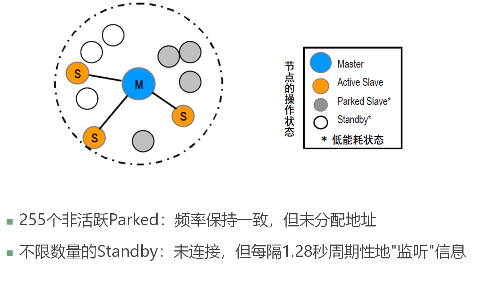

这设备节点，从设备节点，停止等待节点，待机节点


### 蓝牙网络结构

散布式网络（Scatternet）:一个微微网中的某一设备也在另一微微网中作为组成部分存在

微微网与散布式网络的关系

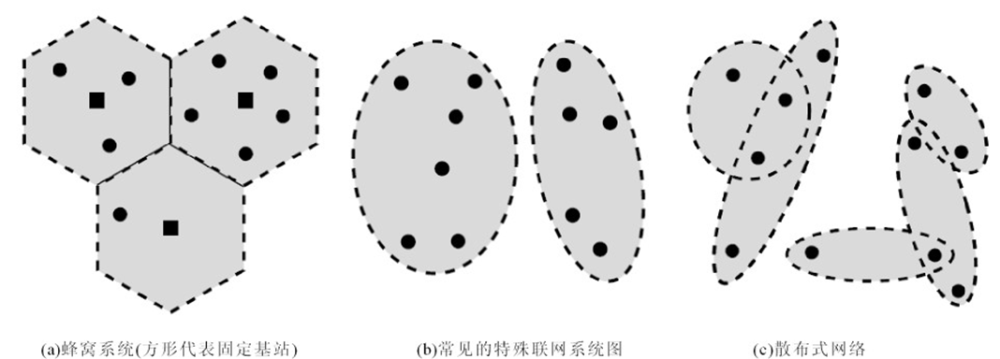


### 蓝牙网络通信特点

1. 成本低
2. 功耗低，体积小
3. 近距离通信
4. 安全性
5. 开放性、兼容性、可移植性


### 蓝牙跳频的方式

跃迁率为1600跳/每秒，每个时隙为0.625ms，跳频序列由主设备决定

1600次/s 0.625ms每次


### 蓝牙网络安全模式

1. 无安全机制：V 2.0 和更早的设备支持该模式

2. 服务级安全：鉴权和加密的机制是在 LMP层完成。 V2.1 以后的版本存在二级安全模式只是为了向前兼容以前版本设备

3. 链路级安全：在物理链路连接完全建立之前，进行安全验证，一旦通过验证，一般不再进行服务级别授权

4. 使用了安全简单配对策略(Secure Simple Pairing，SSP)


### 蓝牙配对的四种方式

使用了安全简单配对策略(Secure Simple Pairing，SSP)

1. Numeric Comparison：配对设备都支持输出

2. Passkey Entry：配对设备一个支持输入，一个支持输出

3. Just Works：配对设备，其中一个既不支持输出，也不支持输入

4. Out of Band：配对设备通过其它通道来传递密钥


### 蓝牙网络设备安全等级

**设备安全等级**

1. 可信任设备：通过了认证，存储了链路密钥，并且被标记为可信任的设备
2. 不可信任设备：通过了认证，存储了链路密钥，但没有被标记为可信任的设备
3. 未知设备：没有相关的安全信息

**服务安全保障机制**

1. 需授权服务：只允许经过授权的设备访问
2. 需认证（鉴权）服务：要求使用服务前必须通过认证
3. 需加密服务：在使用设备前链路必须改为加密模式


### 蓝牙协议栈各层基本功能

1. 无线电（Radio）层——物理层

   分组格式
   纠错
   数据加密

2. 基带（Baseband）层——MAC层

   发送数据
   接收数据
   控制物理层频率跳变

3. 链路管理器协议（LMP）层——链路层

   负责链路管理，包括诸如认证、加密及基带分组大小的控制和协商

4. 逻辑链路控制和自适应协议（L2CAP）层——传输层

   提供无连接和面向连接两种服务，流量控制、数据包重组等，使用ACL链路，不支持SCO链路

5. 服务发现协议层（SDP）——应用层

   负责询问设备信息、服务与服务特征

